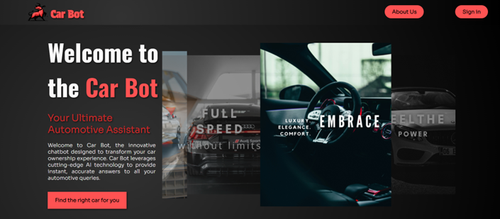

# CAR BOT ASSISTANT - STUDENT PROJECT 

**CarBot** je web aplikacija osmišljena da olakša proces istraživanja i pronalaženja informacija o automobilima, pružajući korisnicima intuitivno iskustvo pretraživanja i interakcije putem chata sa virtuelnim asistentom Car Bot, koji koristi tehnologiju Wit.ai. Problem koji CarBot rešava je potreba korisnika za brzom, tačnom i detaljnom pretragom informacija o automobilima, uključujući cene, specifikacije i slike, bez potrebe za posetom više različitih izvora. Ova aplikacija omogućava korisnicima da pristupe informacijama na jednom mestu, uz mogućnost interakcije putem tekstualnih i glasovnih poruka.


CarBot takođe rešava problem pristupačnosti za korisnike sa različitim potrebama i nivoima interakcije. Aplikacija omogućava korisnicima bez naloga da se upoznaju sa njenim funkcionalnostima, kreiraju nalog i započnu pretragu vozila, dok korisnici sa nalogom mogu da koriste dodatne funkcionalnosti, kao što je direktna komunikacija sa Car Botom. Car Bot koristi naprednu tehnologiju obrade jezika kako bi pružio precizne informacije o automobilima, a za slike automobila se koristi Unsplash API. Na ovaj način, korisnici dobijaju potpunu sliku o automobilu koji ih zanima, uključujući vizuelni prikaz.

Administratori aplikacije imaju ključnu ulogu u upravljanju korisničkim nalozima i praćenju interakcija. Kontrolna tabla im omogućava pregled i organizaciju korisnika na osnovu različitih kriterijuma, uključujući mogućnost pretrage po imenu, sortiranje po broju poruka, i filtriranje po polu. Pored toga, administratorima su dostupne opcije za izmenu podataka korisničkih profila, brisanje korisnika i njihovih poruka, kao i pregled statističkih podataka o radu aplikacije. Integracija sa Finhub API-jem omogućava administratorima da prate i analiziraju cene deonica brendova automobila koji se koriste u aplikaciji, pružajući dodatne informacije korisnicima i pomažući im da donesu informisane odluke.

CarBot aplikacija, izgrađena u MERN stack-u koristeći MVC arhitekturu, rešava problem preopterećenosti informacijama i pomaže korisnicima da na brz i efikasan način dođu do relevantnih podataka o automobilima, dok administratori imaju sveobuhvatan pregled nad korisničkim interakcijama i statistikom aplikacije.


## Instalacija

1. Klonirajte repozitorijum:
   ```bash
   git clone https://github.com/elab-development/internet-tehnologije-projekat-carbot_2020_0249.git
2. Instalirajte biblioteke:
    ```bash
    npm install
3. Udjite u direktorijum za server:
    ```bash
    cd projekat
    cd server
    npm start
4. Udjite u direktorijum za klijenta:
    ```bash
    cd projekat
    cd server
    npm start
5. Pokrenite aplikaciju u web pregledacu i pokrenite caskanje!





